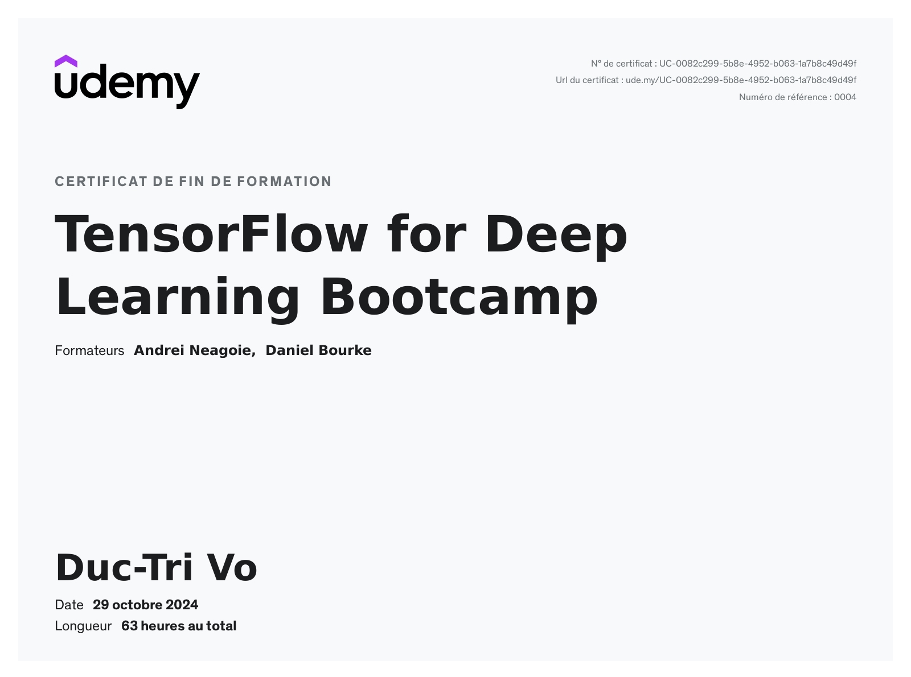

# TensorFlow for Deep Learning Bootcamp

Approximately 63 hours!

Verify link: [Udemy.com](https://www.udemy.com/certificate/UC-0082c299-5b8e-4952-b063-1a7b8c49d49f/)

### Learning objectives:
1. Build TensorFlow models using Computer Vision, Convolutional Neural Networks, and Natural Language Processing  
2. Complete access to ALL interactive notebooks and ALL course slides as downloadable guides  
3. Increase your skills in Machine Learning, Artificial Intelligence, and Deep Learning  
4. Understand how to integrate Machine Learning into tools and applications  
5. Learn to build all types of Machine Learning models using the latest TensorFlow 2  
6. Build image recognition and text recognition algorithms with deep neural networks and convolutional neural networks  
7. Use real-world images to visualize the journey of an image through convolutions to understand how a computer "sees" information, plot loss, and accuracy  
8. Apply Deep Learning for Time Series Forecasting  
9. Gain the skills you need to become a TensorFlow Developer  
10. Be recognized as a top candidate for recruiters seeking TensorFlow developers
